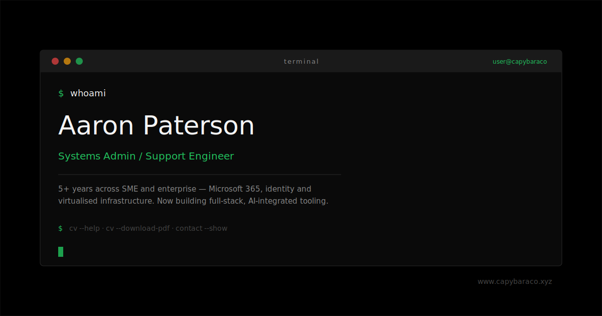

# capybaraco-cv

> A terminal-inspired personal CV — premium and minimalist on first load, then a real, typeable terminal that serves up the CV on command.




## Contents

- [Features](#features)
- [Tech stack](#tech-stack)
- [Getting started](#getting-started)
- [Usage](#usage)
- [Project structure](#project-structure)
- [Make it your own](#make-it-your-own)
- [Design non-negotiables](#design-non-negotiables)
- [Contributing](#contributing)
- [License](#license)

## Features

The default loadout, no filler:

- **Type-to-interact terminal** — a real command parser with keyboard input and
  history (`↑`/`↓`), not a faked screenshot. Visitors type `help` to begin.
- **Premium-first landing** — the opening screen reads clean and minimalist
  before the terminal ever appears. No novelty-hacker kitsch.
- **Hand-rolled motion** — typewriter, reveal-on-scroll, and an ambient Matrix
  `<canvas>` background, all with zero animation libraries.
- **Accessible by default** — semantic landmarks, a labelled input, an
  `aria-live` output log, visible focus, AA contrast, and full
  `prefers-reduced-motion` fallbacks.
- **Brand-tight design tokens** — palette, type, spacing, and motion live as CSS
  custom properties in one place.

## Tech stack

- **Vite + React 18 + TypeScript** — fast dev server, typed components, `dist/`
  build output.
- **Plain CSS with design tokens** — no Tailwind, no CSS-in-JS. Everything keys
  off `src/styles/tokens.css`.
- **No animation libraries** — motion is hand-written hooks plus `<canvas>`.
- **Typography**: `Monaco` / `Menlo` / `Ubuntu Mono` / `Courier New` monospace,
  with a system sans fallback.
- **Tooling**: ESLint (`--max-warnings 0`), `tsc` in strict mode. Node 22, npm.

## Getting started

Zero-to-running is a short speedrun:

```bash
$ git clone https://github.com/Capy-BaraCo/capybaraco-cv.git
$ cd capybaraco-cv
$ npm install
$ npm run dev
```

Other scripts:

```bash
$ npm run build     # tsc -b && vite build  ->  dist/
$ npm run lint      # eslint, warnings fail the run
$ npm run preview   # serve the production build
```

> **Note:** the real CV files (`public/cv.html`, `public/assets/cv.pdf`) are
> gitignored — this repo is public, so the CV is kept local-only. On a fresh
> clone the `cv` commands link to those paths until you add your own copies.

## Usage

Once the terminal is in view, type a command (or `help` to list them all):

| Command | What it does |
|--------------------|------------------------------------------|
| `help` | Show every available command |
| `whoami` | Print name, role, and bio |
| `cv --view-html` | Open the CV in a new tab |
| `cv --download-pdf`| Download the CV as a PDF |
| `cv --help` | Show CV-related options |
| `contact --show` | Display contact information |
| `portfolio` | Portfolio and project info |
| `clear` | Respawn a clean terminal |

```text
~ $ whoami
Aaron Paterson <aaron.paterson@capybaraco.co.uk>
Systems Administrator & Technical Support Engineer
```

## Project structure

```
public/            # static, shipped as-is (og-image.svg, favicon, robots.txt)
  cv.html          # gitignored — real HTML CV, local only
  assets/cv.pdf    # gitignored — real CV PDF, local only
src/
  main.tsx, App.tsx
  data/profile.ts  # single source of truth: name, email, role, bio, links
  styles/          # tokens.css (design tokens), global.css, app.css
  hooks/           # usePrefersReducedMotion, useCommandHistory, ...
  terminal/        # types.ts, commands.ts (registry), runCommand.ts (parser)
  components/
    Terminal/      # shell UI, input, output, history
    Landing/       # premium intro / hero card
    Footer/        # contact + minimal footer
```

## Make it your own

This is a generic terminal-style portfolio — fork it and reskin it as your own
character. Nearly everything lives behind a few clearly-marked files:

| Want to change... | Edit |
|--------------------------------|------------------------------------------------|
| Name, email, role, bio, links | `src/data/profile.ts` (single source of truth) |
| Landing role line | `ROLE` in `src/components/Landing/Landing.tsx` |
| Colours / type / spacing | `src/styles/tokens.css` (design tokens) |
| Available commands | `src/terminal/commands.ts` (command registry) |
| Social/share image | `public/og-image.svg` + `<meta>` in `index.html` |
| Your actual CV | drop `public/cv.html` and `public/assets/cv.pdf` |

The CV files are gitignored on purpose, so a public fork never leaks a private
document. Edit `profile.ts`, swap the accent green in `tokens.css` for your own,
and you have shipped your portfolio.

## Design non-negotiables

These ship in every change — the boss fight is keeping them all true at once:

1. First screen is clean and premium, not a novelty hacker page.
2. `prefers-reduced-motion` is fully respected: instant typing, static dim Matrix
   fallback, no transforms.
3. Palette stays black `#000000` / off-white `#f5f5f5` / green `#22c55e`;
   restrained type, glow only where useful.
4. The terminal stays genuinely functional — real parser, keyboard input,
   history.
5. Accessible and responsive at 360 / 768 / 1280px.

## Contributing

Conventions, architecture notes, and the sprint log live in
[`AGENTS.md`](AGENTS.md). Both `npm run build` and `npm run lint` must pass clean
before any commit — lint runs with `--max-warnings 0`, and `tsconfig` strictness
treats dead imports and unused params as errors.

## License

MIT © 2026 Aaron Paterson · [www.capybaraco.xyz](https://www.capybaraco.xyz) ·
[github.com/Capy-BaraCo](https://github.com/Capy-BaraCo)
